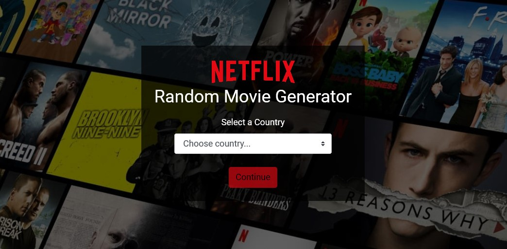
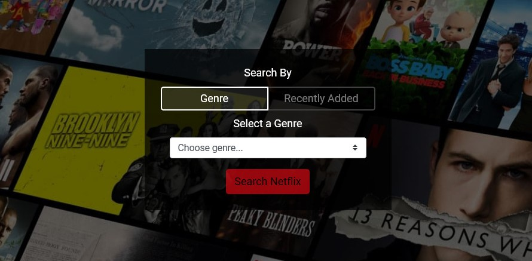

# Netflix Random Movie Generator
> Can't decide which movie to watch on Netflix tonight? Use our random movie generator to help with that choice!

## Table of contents
* [Description](#description)
* [Features](#features)
* [How To Use?](#how-to-use?)
* [Screenshots](#screenshots)
* [Built With](#built-with)
* [Contact](#contact)

## Description
The **Netflix Random Movie Generator** is a web application that queries an API database ([Unogs](https://rapidapi.com/unogs/api/unogs)) of up-to-date movies on netflix and displays a randomly selected movie.

This project aims to make choosing a film from Netflix easier, by displaying one film at a time. This removes the issue of "too much choice" when scanning through the hundreds of available films on Netflix.

## Features
* Search by chosen country
* Search by recently added
* Search by genre (or a generic search by "all genres")
* A "search again" button to repeat the last search
* Movie information displayed - title, synopsis, runtime, released, rating and image

## How To Use?
1. Select a Country from the dropdown list and click "continue"
2. Choose your search parameters, by either clicking on the "recently added" tab, or the "genre" tab and selecting a genre from the dropdown list
3. Click "Search Netflix"
4. Either search with those same parameters again, or click "BACK" to change your search criteria (taking you back to step 2)
5. At any time, click the Country name to choose a different Country (taking you back to step 1)

## Screenshots

## Built With
* HTML
* CSS
* Javascript
* Bootstrap - 4.3.1
* React - 16.9.0
* Node - 10.16.0
* npm - 6.9.0

## Contact
Created by Guy Owen - guy.owen@virginmedia.com